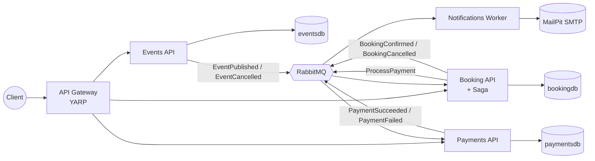
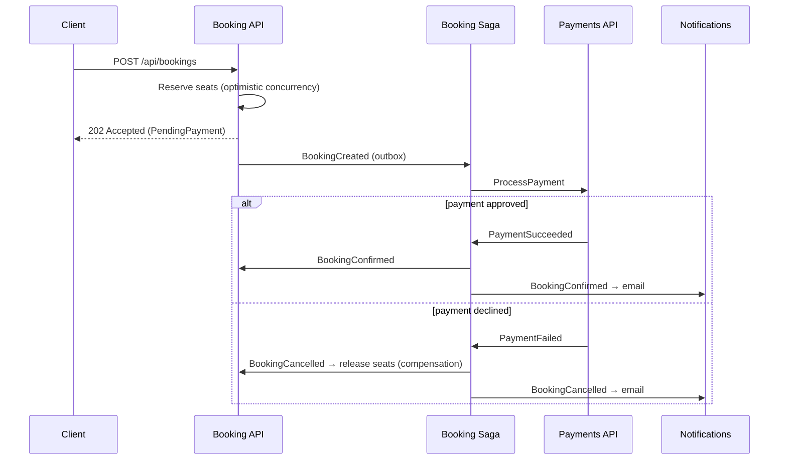

# TicketFlow

[](https://github.com/ebrahimmorkas/ticketflow-microservices/actions/workflows/ci.yml)


An **event ticketing platform** built as **.NET 10 microservices** and orchestrated with **.NET Aspire**. Organisers publish events, customers book tickets, payments are processed asynchronously, and a **saga** keeps everything consistent across services, with no distributed transactions.

## Highlights

| Area | What's implemented |
|---|---|
| **Orchestration** | .NET Aspire AppHost: PostgreSQL, RabbitMQ, MailPit, 4 services and a gateway with one `dotnet run` |
| **Messaging** | MassTransit over RabbitMQ, **transactional outbox + inbox** (EF Core), retries, idempotent consumers |
| **Distributed workflow** | **Saga orchestration** (MassTransit state machine) persisted in PostgreSQL with compensation |
| **Data ownership** | Database per service; **event-carried state transfer** replicates inventory to the Booking service |
| **Concurrency** | Optimistic concurrency (`xmin`) with automatic retry; no overselling |
| **Gateway** | **YARP** with service discovery, rate limiting (token bucket on bookings), correlation ids, **API composition** with graceful degradation |
| **Observability** | OpenTelemetry traces and metrics, including MassTransit spans, in the Aspire dashboard |
| **Testing** | Unit tests with MassTransit's test harness + **end-to-end tests with `Aspire.Hosting.Testing`** booting the whole system in CI |

## Architecture



| Service | Responsibility | Storage |
|---|---|---|
| **Events API** | Event catalog and ticket tiers; publish/cancel workflow | PostgreSQL `eventsdb` |
| **Booking API** | Ticket inventory (replicated), reservations, **checkout saga** | PostgreSQL `bookingdb` |
| **Payments API** | Charges through a payment gateway abstraction, idempotent | PostgreSQL `paymentsdb` |
| **Notifications Worker** | Confirmation and cancellation emails | none |
| **Gateway** | Single entry point, routing, rate limiting, composition | none |

### Checkout saga



## Getting started

Requirements: [.NET 10 SDK](https://dotnet.microsoft.com/download) and Docker.

```bash
dotnet run --project src/TicketFlow.AppHost
```

The Aspire dashboard opens with links to every resource: the gateway, the RabbitMQ management UI, pgAdmin and the **MailPit inbox**, where you can see the emails the platform sends.

### Try it

```bash
# 1. Create and publish an event (use the gateway URL from the dashboard)
curl -X POST $GATEWAY/api/events -H "Content-Type: application/json" -d '{
  "name": "Rock Night", "description": "Live", "venue": "Arena",
  "startsAtUtc": "2027-01-01T20:00:00Z",
  "ticketTypes": [{ "name": "General", "price": 40, "currency": "USD", "capacity": 100 }]
}'
curl -X POST $GATEWAY/api/events/{eventId}/publish

# 2. Check availability and book
curl $GATEWAY/api/events/{eventId}/overview
curl -X POST $GATEWAY/api/bookings -H "Content-Type: application/json" \
  -d '{ "ticketTypeId": "{ticketTypeId}", "quantity": 2, "customerEmail": "fan@example.com" }'

# 3. Watch the booking go from PendingPayment to Confirmed
curl $GATEWAY/api/bookings/{bookingId}
```

The simulated payment gateway declines amounts above 5,000 and any email containing `+decline` (for example `fan+decline@example.com`), so you can see the compensation path as well.

### Tests

```bash
dotnet test                 # unit tests; end-to-end tests are skipped without Docker
RUN_E2E=true dotnet test    # also boots the full system with Aspire.Hosting.Testing
```

## Design decisions

- **Saga orchestration over choreography.** The checkout flow lives in one explicit, testable state machine instead of being spread implicitly across services.
- **Transactional outbox everywhere.** State changes and the messages they produce are committed together, so there are no lost or phantom events when a service crashes between the two.
- **Two levels of idempotency.** The inbox removes duplicate deliveries, and business keys (for example one payment per booking) guarantee a card is never charged twice.
- **Event-carried state transfer.** Booking keeps its own inventory, so selling tickets doesn't depend on the Events service being up.
- **Vertical slices in each service.** The services are small, so each feature is a single file with its endpoint, validation and handler. Compare this with the layered Clean Architecture of [ShopSphere](https://github.com/ebrahimmorkas/shopsphere-api).
- **MassTransit 8.x.** It is the last Apache 2.0 licensed version; v9 requires a commercial licence.

## Project structure

```
src/
  TicketFlow.AppHost              Aspire orchestration
  TicketFlow.ServiceDefaults      OpenTelemetry, health checks, resilience, service discovery
  TicketFlow.Contracts            Integration messages (dependency-free)
  TicketFlow.BuildingBlocks       Messaging/outbox setup, Result type, validation filter
  TicketFlow.Events.Api
  TicketFlow.Booking.Api          + Saga/
  TicketFlow.Payments.Api
  TicketFlow.Notifications.Worker
  TicketFlow.Gateway
tests/
  *.UnitTests                     Domain, consumers, saga (MassTransit test harness)
  TicketFlow.EndToEndTests        Whole-system tests with Aspire.Hosting.Testing
```

## License

[MIT](LICENSE)
